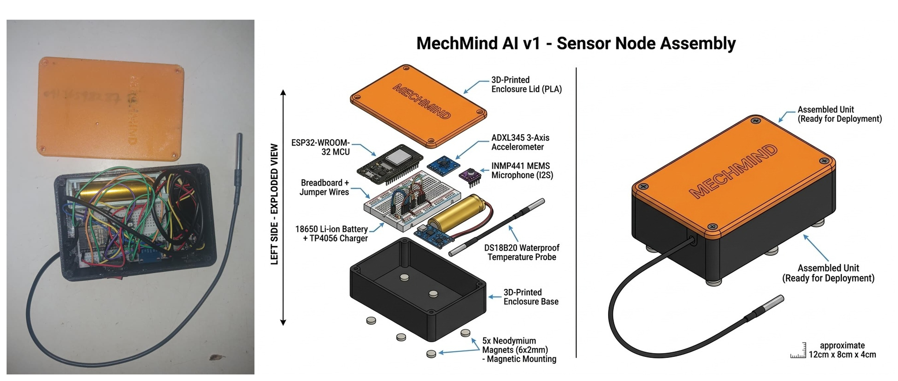
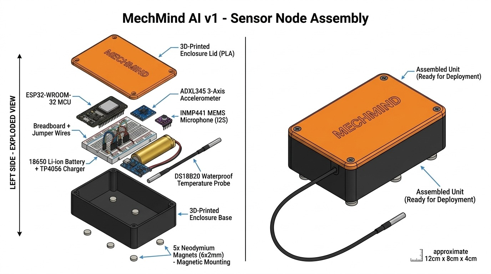

# MechMind AI

> Edge-Enabled Predictive Telemetry and Generative Diagnostic Copilot for Heavy Machinery, Construction Equipment, and Agricultural Fleets

[](#prototype-device-and-hardware-architecture)
[](https://mechmind-ng.vercel.app)
[](#edge-sensor-node-specifications)
[](#intelligent-diagnostic-and-rag-pipeline)
[](#field-interfaces-and-technician-access)
[](#license-and-intellectual-property)

---

## Quick Navigation

- [Executive Overview](#executive-overview)
- [The Problem and Field Genesis](#the-problem-and-field-genesis)
- [System Architecture](#system-architecture)
- [Prototype Device and Hardware Architecture](#prototype-device-and-hardware-architecture)
  - [Physical Node Visuals](#physical-node-visuals)
  - [Hardware Specifications and Pinout](#hardware-specifications-and-pinout)
  - [Power Subsystem and Autonomy](#power-subsystem-and-autonomy)
- [Intelligent Diagnostic and RAG Pipeline](#intelligent-diagnostic-and-rag-pipeline)
- [Field Interfaces and Technician Access](#field-interfaces-and-technician-access)
  - [Live Fleet Web Dashboard](#1-live-fleet-web-dashboard)
  - [WhatsApp Mobile Diagnostic Assistant](#2-whatsapp-mobile-diagnostic-assistant)
- [Repository Directory Structure](#repository-directory-structure)
- [Local Setup and Deployment Guide](#local-setup-and-deployment-guide)
- [Project Documentation and Artifacts](#project-documentation-and-artifacts)
- [Socioeconomic Impact and SDG Alignment](#socioeconomic-impact-and-sdg-alignment)
- [Engineering Team](#engineering-team)

---

## Executive Overview

**MechMind AI** is an industrial IoT telemetry and edge AI diagnostic ecosystem developed to eliminate catastrophic mechanical failures in heavy equipment across Africa. By coupling an untethered, non-invasive edge sensor node with a local Retrieval-Augmented Generation (RAG) diagnostic engine, MechMind continuously captures critical vibration, thermal, and acoustic signatures from operating machinery. 

When anomalies or harmonic stress patterns are detected, MechMind translates raw sensor telemetry into actionable, step-by-step mechanical repair workflows delivered directly to site mechanics and fleet operators via **WhatsApp** and an interactive **Live Web Dashboard**.

```
[ Heavy Machinery: Excavator / Tractor / Generator ]
                         |
           (Non-Invasive Magnetic Mount)
                         v
   +-------------------------------------------+
   |   MechMind Edge Sensor Node (NODE-001)    |
   |   - MPU-6050 3-Axis Accelerometer/Gyro    |
   |   - DS18B20 Digital Temperature Probe     |
   |   - High-Sensitivity Acoustic Microphone  |
   |   - ESP32 Dual-Core (FreeRTOS Telemetry)  |
   |   - 18650 Li-Ion (Pass-Through Charging)  |
   +-------------------------------------------+
                         |
            (WiFi / Cellular 2-Second Cadence)
                         v
   +-------------------------------------------+
   |             FastAPI Backend               |
   |   - Telemetry Ingestion Engine            |
   |   - ISO 10816 Vibration Severity Analyzer |
   |   - Automated Incident Trigger Pipeline   |
   +-------------------------------------------+
          |                             |
          v                             v
+-------------------+         +-------------------+
|  PostgreSQL 15    |         |  ChromaDB Vector  |
|  Time-Series DB   |         |  OEM Service Docs |
+-------------------+         +-------------------+
          |                             |
          +--------------+--------------+
                         v
   +-------------------------------------------+
   |      Local RAG Cognitive Reasoner         |
   |   - Ollama (Quantized Llama 3.1 8B)       |
   |   - Caterpillar / Komatsu / SANY Manuals  |
   |   - SAE J1939 Diagnostic Trouble Codes    |
   +-------------------------------------------+
                         |
         +---------------+---------------+
         v                               v
+--------------------+         +--------------------+
| Live Web Dashboard |         | WhatsApp AI Bot    |
| (Next.js / Vercel) |         | (Baileys + Whisper)|
| Real-time Waveforms|         | Voice, Text, Photos|
+--------------------+         +--------------------+
```

---

## The Problem and Field Genesis

### Frontline Industrial Origin
During undergraduate industrial work experience (SIWES) in engineering workshops and construction project sites, our team observed a recurring, critical vulnerability: heavy equipment—including excavators, crawler bulldozers, agricultural tractors, and industrial generators—frequently suffered catastrophic failures without advance warning. 

A single seized crankshaft, fractured hydraulic pump, or burned bearing collar would halt site operations for weeks. In developing economies, replacement parts often require 4 to 8 weeks for international shipment, turning minor, preventable wear into severe operational downtime costing tens of thousands of dollars.

### The Diagnostic Divide in Africa
1. **Legacy and Used Machinery Fleets**: Over 80% of earthmoving and farm equipment operating across Sub-Saharan Africa is imported second-hand and lacks modern onboard telematics.
2. **Proprietary Vendor Lock-in**: Major global original equipment manufacturers (OEMs) restrict diagnostic data behind proprietary scanners, closed protocols, and high recurring subscription fees unaffordable to independent contractors, local workshops, and smallholder farming syndicates.
3. **Severe Connectivity and Language Barriers**: Rural construction corridors and agricultural farmlands suffer from intermittent cellular bandwidth. Technicians in the field cannot navigate complex enterprise software suites.

MechMind AI was conceived to answer a fundamental operational question: **Instead of waiting for critical machinery to break down, what if we could detect mechanical stress before failure occurs, using accessible edge hardware and everyday communication channels?**

---

## System Architecture

MechMind AI operates on a modular, three-tier architecture designed for continuous field resilience, low operating expenditure, and local execution:

| Architecture Layer | Core Technologies | Primary Function |
| :--- | :--- | :--- |
| **Physical Edge Layer** | ESP32-WROOM-32D, MPU-6050, DS18B20, Electret Acoustic Sensor, TP4056, MT3608 | Collects physical kinematics, casing temperature, and acoustic noise at 0.5 Hz |
| **Data & Ingestion Layer** | Python 3.11, FastAPI, Uvicorn, PostgreSQL 15, SQLAlchemy | Ingests JSON telemetry streams, calculates ISO 10816 thresholds, logs historical time-series |
| **Cognitive Reasoning Layer** | ChromaDB, Ollama, Llama 3.1 8B, Sentence-Transformers | Grounds incoming fault telemetry against digitized OEM workshop service manuals and SAE J1939 fault trees |
| **Operator Interfaces** | Next.js 14, Tailwind CSS, Chart.js / Recharts, Baileys WhatsApp API, faster-whisper | Delivers desktop fleet management visualizations and instant WhatsApp diagnostic dialogue |

---

## Prototype Device and Hardware Architecture

We moved beyond theoretical design by engineering, assembling, and field-validating an untethered, physical hardware prototype: **MechMind Sensor Node 001 (`NODE-001`)**.

### Physical Node Visuals

#### Functional Prototype Unit
The physical prototype integrates dual-core microprocessing, independent 18650 Li-ion power regulation, thermal sensing, acoustic reception, and inertial motion analysis inside a protective enclosure with magnetic mounting.



#### Assembly and Electrical Schematic
Complete wiring schematic illustrating pinouts, I2C pullups, analog signal conditioning, and dual-rail power isolation.



### Hardware Specifications and Pinout

| Subsystem | Component | Bus / Protocol | ESP32 Pin | Engineering Parameter / Operating Envelope |
| :--- | :--- | :--- | :--- | :--- |
| **Microcontroller** | ESP32-WROOM-32D | Dual Core Xtensa 240MHz | Integrated | 520 KB SRAM, 4 MB Flash, 2.4 GHz 802.11 b/g/n |
| **Vibration & Motion** | MPU-6050 6-DOF IMU | I2C (Address `0x68`) | SDA: `GPIO 21`<br>SCL: `GPIO 22` | ±16g acceleration, ±2000°/s gyro, 3-axis RMS vibration calculation |
| **Thermal Sensing** | DS18B20 Waterproof Probe | 1-Wire (4.7 kΩ pull-up) | Data: `GPIO 4` | -55°C to +125°C range, ±0.5°C accuracy (hydraulic line / engine block) |
| **Acoustic Noise** | High-Sensitivity Microphone | Analog ADC | Audio Out: `GPIO 34` | 35 dB to 120 dB acoustic pressure level (pump cavitation / bearing friction) |
| **Status Indicator** | Surface-Mount Status LED | Digital Out | `GPIO 2` | Heartbeat pulse, sensor error alert, and WiFi synchronization indicator |

### Power Subsystem and Autonomy
Field equipment cannot rely on external cabling or fragile cigarette-lighter adapters. MechMind features a self-contained, isolated power circuit:
- **Cell**: High-drain 3.7V 18650 Lithium-Ion rechargeable cell (2600 mAh capacity).
- **Protection & Charging**: TP4056 management IC with integrated DW01A battery protection and dual FS8205A MOSFETs (guards against overcharge >4.2V and over-discharge <2.5V).
- **Step-Up Converter**: MT3608 DC-DC booster delivering steady, ripple-filtered 5.0V output to the ESP32 `VIN` rail.
- **True Pass-Through Charging**: Allows the node to charge via 5V USB Type-C while continuously streaming live telemetry without brownout or reboot.
- **Battery Life**: 12+ continuous hours on active WiFi broadcast; extendable to 72+ hours using firmware deep-sleep duty cycles.

---

## Intelligent Diagnostic and RAG Pipeline

Standard telematics dashboards display raw graphs that leave mechanics guessing. MechMind integrates an edge-grounded Retrieval-Augmented Generation (RAG) diagnostic engine that interprets numbers into root-cause solutions:

1. **Telemetry Parsing**: The FastAPI backend ingests sensor vectors (`accel_x`, `accel_y`, `accel_z`, `temperature`, `sound_level`).
2. **Threshold & Waveform Classification**:
   - Compares RMS vibration against **ISO 10816** mechanical vibration standards for industrial machinery.
   - Detects thermal divergence (>85°C hydraulic baseline; >102°C engine block warning).
   - Identifies acoustic peaks indicating pump cavitation or gear mesh teeth pitting.
3. **ChromaDB Vector Retrieval**:
   - Queries high-dimensional vector embeddings generated from workshop service manuals (Caterpillar 320D, Komatsu PC200, SANY SY215C, Cummins QSB6.7, Perkins 1104D).
   - Retrieves exact repair sections, torque limits, filter part numbers, and SAE J1939 fault trees.
4. **Quantized Local LLM Inference**:
   - Powered by `llama3.1:8b` via Ollama with 4-bit quantization for fast execution on standard workstation hardware without API fees.
   - Hallucination safeguard: Explicit system prompts restrict the model to verified OEM documentation, instructing it to decline advice when diagnostic confidence is insufficient.

---

## Field Interfaces and Technician Access

### 1. Live Fleet Web Dashboard
- **Production URL**: [https://mechmind-ng.vercel.app](https://mechmind-ng.vercel.app)
- **Built With**: Next.js 14, React, Tailwind CSS, Responsive Charting.
- **Capabilities**:
  - Real-time 3-axis kinematic vibration tracking (X, Y, Z acceleration waveforms).
  - Acoustic decibel pressure meter and thermal trend monitoring.
  - Multi-asset switching (Excavators, Wheel Loaders, Agricultural Tractors, Heavy Generators).
  - Calculated Machine Health Score index (0% - 100%) with automated status badges (Normal, Caution, Critical).
  - Downloadable diagnostic reports and scheduled maintenance checklists.

### 2. WhatsApp Mobile Diagnostic Assistant
- **Dedicated Demonstration Line**: `+234 701 029 9562`
- **Core Technology**: Baileys WebSockets WhatsApp Framework + faster-whisper local STT.
- **Why WhatsApp?**: In African industrial environments, WhatsApp is ubiquitous, familiar, and works seamlessly over 2G/3G connections. Technicians do not need to install heavy enterprise applications.
- **Field Workflow**:
  - **Natural Language Inquiries**: A technician types *"Why is the Komatsu PC200 vibrating violently at 1800 RPM and the hydraulic temperature is 94C?"*
  - **Voice Notes**: Mechanics wearing greasy gloves can record voice notes in English or Nigerian Pidgin; the audio is processed via Whisper and answered with step-by-step diagnostic procedures.
  - **Automated Alerts**: When the edge node detects an imminent failure threshold, the backend automatically pushes a prioritized WhatsApp alert to the fleet supervisor.

---

## Repository Directory Structure

```
mechmind-ai/
├── backend/                        # FastAPI REST & Ingestion Backend
│   ├── main.py                     # API entrypoint, CORS, route definitions
│   ├── config.py                   # Environment configuration & thresholds
│   ├── datasets/                   # AI4I 2020 predictive maintenance datasets
│   │   ├── ai4i_loader.py          # Synthetic & industrial dataset loaders
│   │   └── data/                   # Raw CSV training & validation sets
│   ├── database/                   # PostgreSQL schema models & connections
│   │   ├── connection.py           # Engine & sessionmaker configuration
│   │   └── models.py               # Telemetry logs, asset registries, alert tables
│   ├── ingestion/                  # Edge telemetry ingest & RAG pipelines
│   │   ├── chroma_storage.py       # ChromaDB vector embedding & query client
│   │   ├── rag_engine.py           # Retrieval-Augmented Generation coordinator
│   │   └── telemetry_stream.py     # Live sensor packet processor & ISO thresholding
│   ├── requirements.txt            # Python dependencies (FastAPI, ChromaDB, etc.)
│   └── Dockerfile                  # Production container definition
│
├── firmware/                       # ESP32 Physical Edge Node Firmware
│   └── mechmind_node/
│       └── mechmind_node.ino       # FreeRTOS tasks, I2C/1-Wire drivers, WiFi JSON client
│
├── dashboard/                      # Next.js Fleet Telemetry Web Dashboard
│   ├── app/                        # App router, pages, and API proxies
│   ├── components/                 # Metric gauges, real-time waveform charts
│   ├── public/                     # Static icons, diagrams, and assets
│   ├── package.json                # Dashboard dependencies & Next.js scripts
│   └── tailwind.config.js          # Industrial theme tokens & styling
│
├── website/                        # Product Brief & Landing Portal
│   ├── index.html                  # Responsive marketing & overview portal
│   └── .gitignore                  # Deployment exclusion rules
│
├── whatsapp-bot/                   # WhatsApp Field Assistant Gateway
│   ├── index.js                    # Baileys WhatsApp client, session store, message handler
│   ├── whisper_client.py           # Local speech-to-text bridge for voice notes
│   └── package.json                # Node.js dependencies
│
├── docs/                           # Technical Dossier, Pitch Decks & Prototype Visuals
│   ├── SYSTEM_ARCHITECTURE.md      # In-depth 250-line technical engineering dossier
│   ├── MechMind_AI_Pitch_Deck.pdf  # 9-Slide Investor & Competition Pitch Deck
│   ├── MechMind_AI_Technical_Specs.pdf # 7-Page Hardware Specs, Schematics & Budget
│   ├── MechMind_AI_Prototype.jpg   # High-resolution physical prototype photograph
│   └── Sensor_Node_Assembly_Diagram.jpg # Complete wiring & electrical schematic
│
├── docker-compose.yml              # Multi-container orchestration (Postgres, ChromaDB)
└── README.md                       # Master project overview and execution guide
```

---

## Local Setup and Deployment Guide

### Prerequisites
- Python 3.10 or 3.11
- Node.js 18.x or 20.x and npm
- Docker and Docker Compose
- Arduino IDE or PlatformIO (for flashing ESP32 firmware)
- Ollama installed locally with `llama3.1:8b`

### Step 1: Clone the Repository
```bash
git clone https://github.com/DevMubarak1/mechmind-ai.git
cd mechmind-ai
```

### Step 2: Spin Up Databases (PostgreSQL and ChromaDB)
```bash
docker-compose up -d
```
Verify containers are healthy:
```bash
docker ps
# Confirms postgres:15 on port 5432 and chromadb/chroma on port 8000
```

### Step 3: Launch Local AI Cognitive Engine
```bash
ollama serve
# In a separate terminal or shell:
ollama pull llama3.1:8b
```

### Step 4: Configure and Run FastAPI Backend
```bash
cd backend
python -m venv .venv

# On Windows:
.venv\Scripts\activate
# On Linux/macOS:
source .venv/bin/activate

pip install -r requirements.txt
python main.py
```
The REST API and interactive Swagger documentation will be available at:
`http://localhost:8000/docs`

### Step 5: Start the Next.js Telemetry Dashboard
```bash
cd ../dashboard
npm install
npm run dev
```
Open `http://localhost:3000` to interact with the live fleet telemetry waveforms.

### Step 6: Initialize the WhatsApp Field Assistant
```bash
cd ../whatsapp-bot
npm install
node index.js
```
A terminal QR code will be generated. Scan it with WhatsApp on any mobile device to pair the diagnostic bot.

### Step 7: Flash the ESP32 Firmware
1. Open `firmware/mechmind_node/mechmind_node.ino` in the Arduino IDE.
2. Install required board packages: **ESP32 by Espressif Systems**.
3. Install required libraries: `Adafruit MPU6050`, `DallasTemperature`, `OneWire`, `ArduinoJson`.
4. Configure your WiFi credentials and your backend host IP in the header.
5. Select **ESP32 Dev Module**, choose the corresponding COM port, and click **Upload**.

---

## Project Documentation and Artifacts

Comprehensive engineering documentation, specifications, and presentation materials are preserved directly within this repository:

- **[Live Web Telemetry Dashboard](https://mechmind-ng.vercel.app)**: Real-time public demonstration portal.
- **[System Architecture Reference (Markdown)](docs/SYSTEM_ARCHITECTURE.md)**: Exhaustive engineering breakdown covering data schemas, free-space damping, thermal dissipation, and fail-safes.
- **[Executive Pitch Deck (PDF)](docs/MechMind_AI_Pitch_Deck.pdf)**: 9-slide master executive and investor pitch deck.
- **[Technical Specifications & Budget Dossier (PDF)](docs/MechMind_AI_Technical_Specs.pdf)**: 7-page comprehensive specification, BOM, component cost breakdown, and certification path.

---

## Socioeconomic Impact and SDG Alignment

MechMind AI directly contributes to key United Nations Sustainable Development Goals (SDGs) and the African Union Agenda 2063:

- **SDG 2 (Zero Hunger)**: Mitigating sudden tractor and irrigation pump breakdowns during critical planting and harvesting seasons, safeguarding agricultural yield.
- **SDG 8 (Decent Work & Economic Growth)**: Upskilling local technicians and informal mechanics with AI-powered diagnostic knowledge, protecting SME contractor margins.
- **SDG 9 (Industry, Innovation & Infrastructure)**: Delivering affordable industrial telemetry to prevent infrastructure project delays across African transport and energy corridors.
- **SDG 12 (Responsible Consumption & Production)**: Extending the operational lifespan of heavy machinery through predictive intervention, curbing unnecessary scrap and premature capital write-offs.
- **Right to Repair**: Breaking proprietary OEM vendor monopolies under the African Continental Free Trade Area (AfCFTA) by equipping independent workshops with open diagnostic intelligence.

---

## Engineering Team

- **Mubarak Raji Babatunde** — Founder & AI Software Lead  
  *Backend architecture, local RAG pipeline, ChromaDB vector collections, Next.js telemetry dashboard, WhatsApp bot.*
- **Olawale** — Hardware & Firmware Systems Lead  
  *ESP32 embedded firmware, sensor calibration (MPU-6050, DS18B20), power isolation, and physical prototype packaging.*
- **Ramadan** — Technical Documentation & Field Validation  
  *Field testing protocols, workshop manual collation, demonstration media, and regulatory compliance.*

---

## License and Intellectual Property

Copyright (c) 2026 MechMind AI Engineering Team. All rights reserved.

